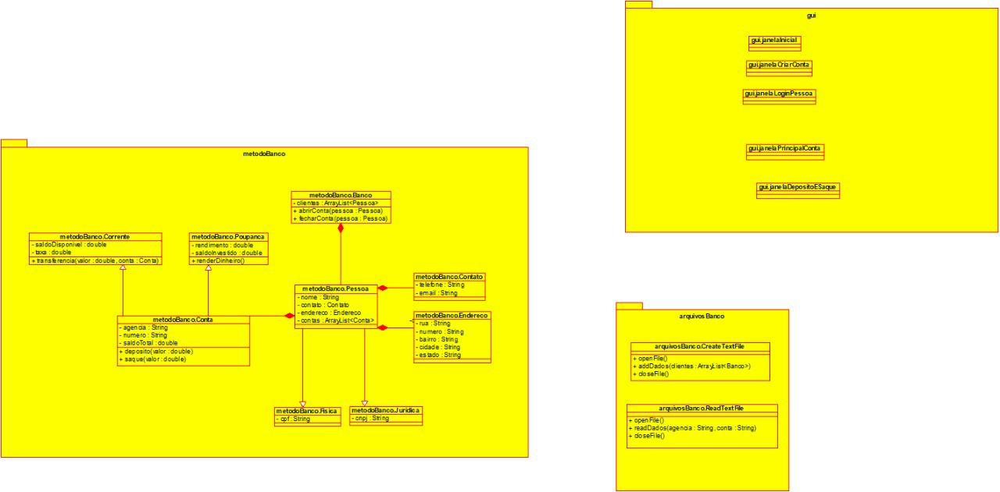

# Trabalho Final PC2 (CEFET-MG)
Integram este grupo os seguintes alunos do curso de *Engenharia de Computacao (2019.2)*: **Lucas Cota, Bruna Gomes, Leonardo, Tulio Horta e Erick Henrique.**

## SISTEMA BANCARIO BASICO
O trabalho consiste na producao de um projeto orientado a objetos no modelo organizacional *MVC*, este que divide em pacotes diferentes a estrutura logica, o processamento de eventos e a interface *GUI*, garantindo maior autonomia entre os componentes do software e otimizando todo o processo de desenvolvimento grupal do sistema. Dentre as opcoes tematicas disponibilizadas, optamos por um pseudossistema bancario. Implementaremos, portanto, telas de login e cadastro, a realizacao de operacoes pelo usuario, diferentes modalidades de contas bancarias, o armazenamento de dados no disco rigido para posterior reaproveitamento etc.

### Diagrama UML (*padronizacao MVC*)
Segue anexo o diagrama do projeto, sendo o pacote *GUI* correspondente a apresentacao, o *metodoBanco* ao modelo e o *arquivosBanco* a implementacao.

